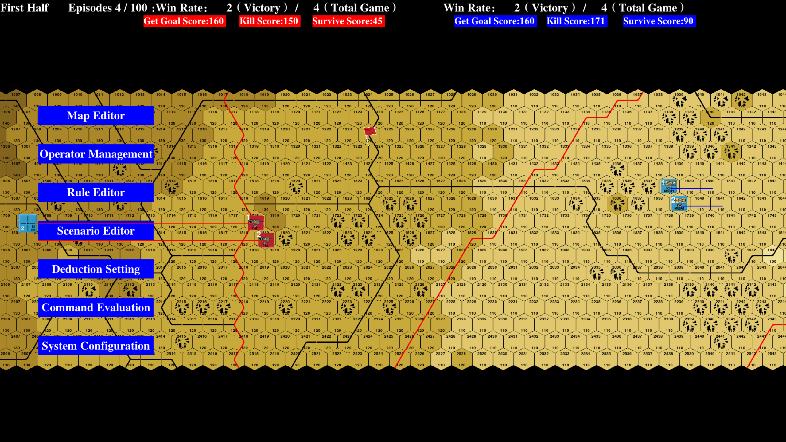

## Welcome to BinLi's Homepage

### Research Interests
- Reinforcement Learning
- Intelligent Game

### Education
M.E. Nanjing University 蓝色
B.E. Northeastern University 蓝色
2016.9-2020.6

### Paper
Hierarchical Architecture for Multi-agent Reinforcement Learning in Intelligent Game (IJCNN 2022 UnderReview)

Design and implementation of intelligent game system based on Reinforcement Learning——wargaming as an example
### Project
Multi-agent deep reinforcement learning task planning model

### Professional skills
Python, PyTorch
